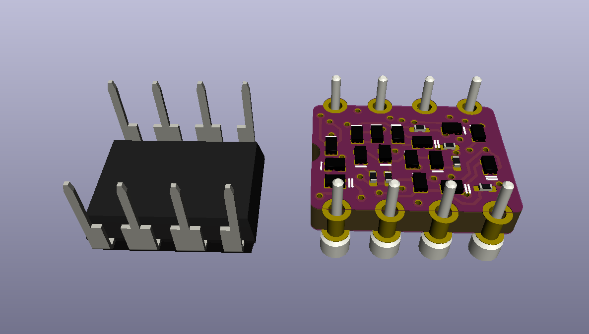

# VS555

## A 555-style timer made of discrete components, DIP-8 size

Evil Mad Scientist Labs famously [scaled up the 555 timer](https://shop.evilmadscientist.com/productsmenu/652), splitting it into discrete parts. Can it be scaled back down to DIP-8 size, but keeping the discrete parts?

Albert van Dalen created a [wager to shrinkify EMSL's discrete 741 op-amp](https://www.avdweb.nl/div/misc2/discrete-741-operational-amplifier-in-dil8). Additional info on [hackaday.io](https://hackaday.io/project/177194-discrete-741-operational-amplifier-in-dil8). My approach to that challenge is [here](https://github.com/settinger/discrete741). It seemed only natural to extend it to EMSL's 555 kit, also!

The discrete 555 IC has 6 more transistors than the discrete 741 IC, so I didn't even try for a one-sided component layout. I had to use 4 layers, as well. The BJTs are in the SOT-883L package (1.0mm by 0.6mm, a wee bit wider than an 0402 component). There are probably some more space savings to be gained by finding a cleverer part arrangement and by switching from KiCad's 0201 footprint to a more compact 0201 footprint.

TODO: Re-check design, order boards and parts if I'm feeling brave, order stencil if I'm not feeling _that_ brave, figure out how a nifty demo.

